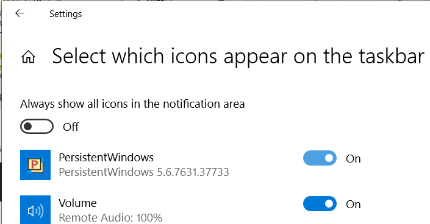

# PersistentWindows
This project addresses a long-standing [issue](https://answers.microsoft.com/en-us/windows/forum/windows_10-hardware/windows-10-multiple-display-windows-are-moved-and/2b9d5a18-45cc-4c50-b16e-fd95dbf27ff3?page=1&auth=1) in Windows 7, 10, and 11, where windows get repositioned after events such as the system waking up, external monitor connections or disconnections, changes in monitor resolution (e.g., exiting full-screen gaming), or during RDP reconnections. The code was forked from [ninjacrab.com/persistent-windows](http://www.ninjacrab.com/persistent-windows/).

## Original Description
> What is PersistentWindows?
>
> A poorly named utility that persists window positions and size when the monitor display count/resolution adjusts 
and restores back to its previous settings.
>
> For those of you with multi-monitors running on a mixture of DisplayPort and any other connection, you can run 
this tool and not have to worry about re-arranging when all is back to normal.

## Key Features
- Keeps track of window position changes, and automatically restores the desktop layout, including the taskbar position, to the last matching monitor setup.
- Supports remote desktop sessions with multiple display configurations.
- Capture windows to disk: saves desktop layout captures to the hard drive in liteDB format, so that closed windows can be restored after a reboot.
- Capture snapshot: saves desktop layout snapshots in memory (max 36 for each display configuration). The window z-order is preserved in the snapshot. This feature can be used as an alternative to virtual desktops on Windows 10.
- Auto Restore can be paused/resumed as desired.
- Supports automatic upgrades.
- Supports foreground and background dual position switching. 
- For more Features and Commands, take a look at the [Quick Help page](https://www.github.com/kangyu-california/PersistentWindows/blob/master/Help.md)

## Installation
- Download the latest PersistentWindows*.zip file from the [Releases](https://github.com/kangyu-california/PersistentWindows/releases) page
- Unzip the file into any directory.
    * Note, the program can be run from any directory, but the program saves its data in `C:\Users\[User]\AppData\Local\PersistentWindows`
- To automatically start PersistentWindows at user login, double-click `auto_start_pw.bat`. This will create a task in the Task Scheduler.
    * For PersistentWindows to be able to restore windows with elevated privileges for tools like Task Manager and Event Viewer, `auto_start_pw.bat` should be run as administrator. 
    

## Usage Instructions
- Run `PersistentWindows.exe` (preferably as administrator). Note that this app has no main window and its icon is hidden in the System Tray area on the taskbar by default.
- To have the icon always appear on the taskbar, flip on the PersistentWindows item in the taskbar settings.
  
- Right click the PersistentWindows icon to show the menu, where the capture and restore actions can be selected.
  

- To restore the taskbar position, avoid moving mouse when the icon turns red.
- When software upgrades are available, a notice will show up in the menu.

## Privacy Statement
- PersistentWindows performs its duty by collecting following information:
  * window position
  * window size
  * window z-order
  * window caption text
  * window class name
  * process id and command line of the window
  * key-strokes when interacting with the PersistentWindows icon on taskbar
  * Ctrl, Alt, Shift key strokes when clicking or moving a window
- The information of the key-strokes is typically stored for less than 2 seconds
- Window information history is kept in memory or in the hard drive in LiteDB file format, waiting to be recalled by auto/manual restore
- PersistentWindows periodically checks the github repository for software version upgrades. This can be disabled in the options menu.
  
## Known Issues
- **Multiple invocations of "Restore windows from disk" might be needed in order to recover all missing windows after system startup.**
- PersistentWindows can get stuck in a "busy" state (with a red icon in the System Tray) during a restore if one of the windows becomes unresponsive. You may find out the culprit window in Task Manager using "Analyze wait chain". The unresponsive app might need an immediate hot-upgrade, or need to be killed to let PersistentWindows proceed

  
  

## Tips To Digest Before Reporting A Bug
- The window z-order can be restored in addition to the two-dimentional layout. This feature is enabled for snapshot restore only.
- To help me diagnose a bug, please run Event Viewer, locate the "Windows Logs" -> "Application" section, then search for Event ID 9990 and 9999, and copy-paste the content of these events to the new issue report, as shown in following example
  
- If there are too many events to report, click "Filter current log" from the Action panel in event viewer, choose all 9990 and 9999 events in last hour, then click "Save Filtered Log File As", and attach the saved events file in the bug report
  
  

